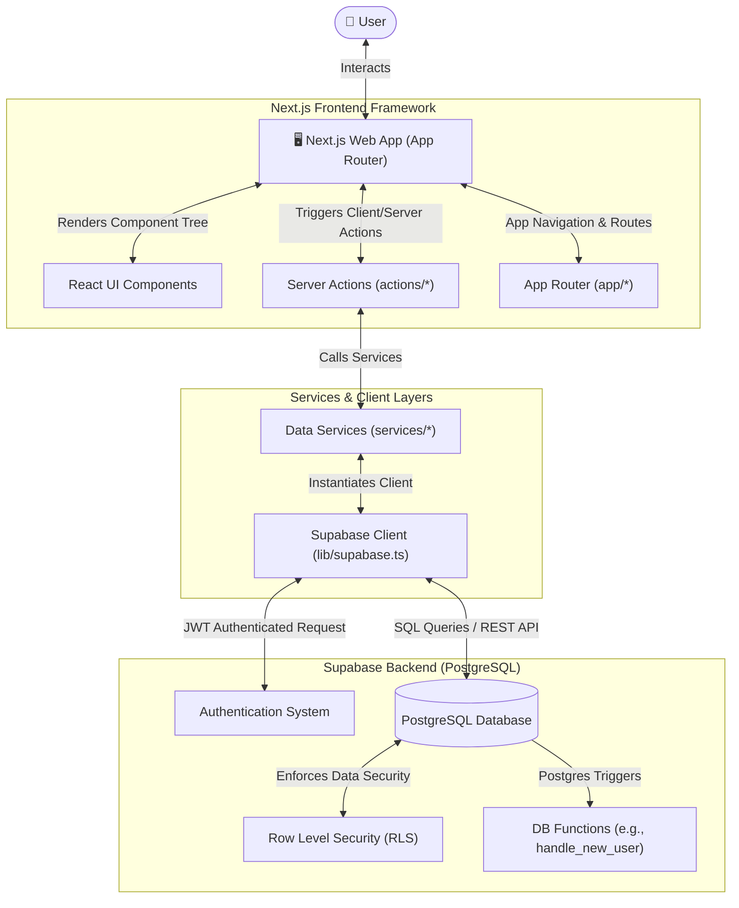
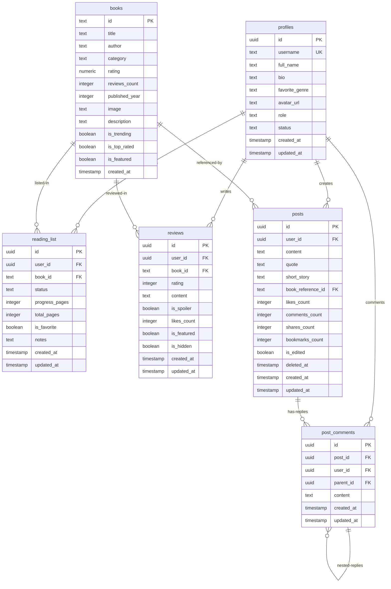

# 📚 BookVerse — Cozy Reading Companion & Interactive Community

Welcome to **BookVerse**, a modern, feature-rich Next.js web application built with Supabase, Tailwind CSS v4, and Framer Motion. BookVerse serves as a quiet café for readers—offering a personalized reading journal, granular book analytics, and a Threads-style community feed to discuss literature in real time.

---

## 🗺️ Interactive Navigation

Use the quick links below to navigate this document:

*   [✨ Core Features](#-core-features)
*   [🏗️ System Architecture](#️-system-architecture)
*   [🗃️ Database Schema](#️-database-schema)
*   [📁 Project Directory Tour](#-project-directory-tour)
*   [⚙️ Environment Setup & Database Migrations](#️-environment-setup--database-migrations)
*   [🚀 Running Locally & Commands](#-running-locally--commands)
*   [🎨 Design System & Visual Aesthetics](#-design-system--visual-aesthetics)

---

## ✨ Core Features

<details open>
<summary><b>📖 Cozy Reading Journal & Library (Expand / Collapse)</b></summary>

*   **Custom Reading Lists:** Categorize books into `Want to Read`, `Currently Reading`, `Completed`, or `Dropped`.
*   **Reading Progress Tracker:** Log page-by-page progress with custom notes and bookmarks.
*   **Reading Streaks & Aggregate Stats:** SQL-aggregate counters tracking total books read, pages consumed, active streaks, and favorite genres.
</details>

<details>
<summary><b>💬 Threads-Style Community Feed (Expand / Collapse)</b></summary>

*   **Rich Post Formats:** Share thoughts using plain text, blockquotes, short stories, image galleries, and book reference tags.
*   **Interactive Engagement:** Like reviews, save bookmarks, and reply with multi-level nested comments.
*   **Hashtag Indexing:** Automatically parse, index, and trend active `#hashtags` across the entire community feed.
*   **Live Notifications:** Real-time feedback when other users comment or like your posts.
</details>

<details>
<summary><b>🛡️ Moderation & Administrative Portal (Expand / Collapse)</b></summary>

*   **Role-Based Access Control:** Secure boundaries for `User`, `Moderator`, and `Admin` accounts.
*   **Real-time Moderation Reports:** Review and resolve reports on flagged comments, posts, or users.
*   **Book & Genre Management:** Seamless CRUD options to publish books and order genre categories.
*   **Banner Announcements:** Broadcast announcements sitewide instantly.
*   **System Controls:** Toggle maintenance mode, restrict registrations, or restrict community features.
</details>

<details>
<summary><b>🎨 Cozy Café Dark & Light Theme (Expand / Collapse)</b></summary>

*   **Premium Visuals:** Custom-tailored parchment colors, velvet crimson/burgundy accents, and antique gold highlights.
*   **Fluid Animations:** Built with Framer Motion for organic, springy transitions and micro-hover states.
</details>

---

## 🏗️ System Architecture

BookVerse leverages Next.js App Router server capabilities communicating directly with Supabase via client wrappers and server actions.



---

## 🗃️ Database Schema

BookVerse runs on a relational PostgreSQL database hosted on Supabase, featuring strict Foreign Key restraints, indexing, and Row Level Security (RLS) policies.

### Entity Relationship Diagram (ERD)



### Table Definitions Reference

<details>
<summary>📂 View Table Schemas Reference (Expand / Collapse)</summary>

#### 👤 `profiles`
Holds general details for users, moderators, and administrators.

| Column | Type | Constraints | Description |
| :--- | :--- | :--- | :--- |
| `id` | `UUID` | `PRIMARY KEY`, `REFERENCES auth.users(id)` | Linked directly to user credentials. |
| `username` | `TEXT` | `UNIQUE` | Unique user handler. |
| `full_name` | `TEXT` | - | Display name of the user. |
| `bio` | `TEXT` | - | Self description. |
| `favorite_genre` | `TEXT` | - | Favorite genre category. |
| `avatar_url` | `TEXT` | - | Public URL to profile thumbnail. |
| `role` | `TEXT` | `CHECK (role IN ('user', 'moderator', 'admin'))` | RBAC authentication level. |
| `status` | `TEXT` | `CHECK (status IN ('active', 'suspended', 'banned'))` | User status flag. |

#### 📚 `books`
Contains metadata regarding the library catalog.

| Column | Type | Constraints | Description |
| :--- | :--- | :--- | :--- |
| `id` | `TEXT` | `PRIMARY KEY` | Text ID (e.g. Google Books ID). |
| `title` | `TEXT` | `NOT NULL` | Title of the publication. |
| `author` | `TEXT` | `NOT NULL` | Primary author. |
| `category` | `TEXT` | `NOT NULL` | Main genre classification. |
| `rating` | `NUMERIC(3,2)` | `DEFAULT 0.00` | Current aggregate rating. |
| `reviews_count` | `INTEGER` | `DEFAULT 0` | Total reviews written. |
| `published_year`| `INTEGER` | `NOT NULL` | Year published. |
| `image` | `TEXT` | - | Cover image web url. |
| `is_trending` | `BOOLEAN` | `DEFAULT false` | Showcases in trending shelves. |
| `is_featured` | `BOOLEAN` | `DEFAULT false` | Promoted hero book. |

#### 📝 `reading_list`
User-specific lists to track logs and updates.

| Column | Type | Constraints | Description |
| :--- | :--- | :--- | :--- |
| `id` | `UUID` | `PRIMARY KEY`, `DEFAULT gen_random_uuid()` | Unique entry record. |
| `user_id` | `UUID` | `FK REFERENCES profiles(id) ON DELETE CASCADE` | Owner profile. |
| `book_id` | `TEXT` | `FK REFERENCES books(id) ON DELETE CASCADE` | Connected book catalog. |
| `status` | `TEXT` | `CHECK IN ('want-to-read', 'currently-reading', 'completed', 'dropped')` | Current reading state. |
| `progress_pages`| `INTEGER` | `CHECK (progress_pages >= 0)` | Read pages count. |
| `total_pages` | `INTEGER` | `CHECK (total_pages > 0)` | Length of book. |
| `is_favorite` | `BOOLEAN` | `DEFAULT false` | Favorite catalog checkbox. |

</details>

---

## 📁 Project Directory Tour

<details>
<summary>📂 View Folders & Component Roles Mapping (Expand / Collapse)</summary>

```
my-app/
├── actions/             # Next.js Server Actions (Auth checking, moderation, and DB writes)
├── app/                 # Next.js App Router (File-based routing & layouts)
│   ├── (auth)/          # Authentication flow (Login, Sign-Up)
│   ├── (main)/          # Core Application views (Feed, Library, Settings, Dashboard)
│   ├── admin/           # Administrative portal (Moderation, Site settings, Analytics)
│   └── maintenance/     # Soft landing page when site mode switches to offline
├── components/          # Reusable React UI Elements
│   ├── auth/            # Auth forms and state triggers
│   ├── community/       # Post grids, nested comments, and activity modals
│   ├── landing/         # Marketing hero and intro slides
│   ├── profile/         # User statistics cards and custom shelves
│   └── (layouts)/       # Navbar, Footer, and Toast notification triggers
├── constants/           # Constant key structures and category metadata
├── hooks/               # Custom state wrappers
├── lib/                 # Core library initializers (Supabase Client, helper classes)
├── services/            # Direct DB queries and PostgreSQL integrations
├── styles/              # Global custom style configs (Tailwind setup)
├── types/               # Core TypeScript definitions (Profiles, Posts, Books)
└── utils/               # Sanitizers and helper algorithms
```
</details>

---

## ⚙️ Environment Setup & Database Migrations

### 1. Supabase Initialization
Create a project on [Supabase Console](https://supabase.com) and retrieve your keys.

### 2. Configure Environment Variables
Create a file named `.env.local` inside `my-app/` with the following variables:

```bash
NEXT_PUBLIC_SUPABASE_URL=https://your-project-id.supabase.co
NEXT_PUBLIC_SUPABASE_ANON_KEY=your-supabase-public-anon-key
SUPABASE_SERVICE_ROLE_KEY=your-supabase-service-role-key # For Admin tasks
```

### 3. Run Database Migrations
Copy and run the contents of the following SQL scripts in order in the **Supabase SQL Editor**:

1.  [`supabase_schema.sql`](file:///p:/BookReview/my-app/supabase_schema.sql) — Generates core catalogs, lists, reviews tables, and basic RLS policies.
2.  [`supabase_community_feed.sql`](file:///p:/BookReview/my-app/supabase_community_feed.sql) — Generates community feed tables, triggers for handles, comments, and real-time functions.
3.  [`supabase_admin_schema.sql`](file:///p:/BookReview/my-app/supabase_admin_schema.sql) — Creates administrative roles, reported post lists, announcements feed, site configuration tables, and seeds initial values.

---

## 🚀 Running Locally & Commands

Get the application running locally in minutes:

### Install Dependencies
```bash
npm install
```

### Start Development Server
```bash
npm run dev
```
Open [http://localhost:3000](http://localhost:3000) on your local browser.

### Build Production Bundle
```bash
npm run build
```

---

## 🎨 Design System & Visual Aesthetics

BookVerse employs a premium, highly responsive user interface designed around a cozy, tactile reading aesthetic:

*   **Warm Café Theme:** Tailored HSL backgrounds resembling clean parchment (`#faf6ee` or `Brand-Cream`), dark walnut espresso headings (`#261a0f`), cozy forest greens, and deep burgundy crimson accents.
*   **Responsive layouts:** Flexible responsive containers custom built for mobile screens, tablets, and desktop setups.
*   **Optimized typography:** Loads standard display typefaces smoothly with high contrast support for reading ease.
